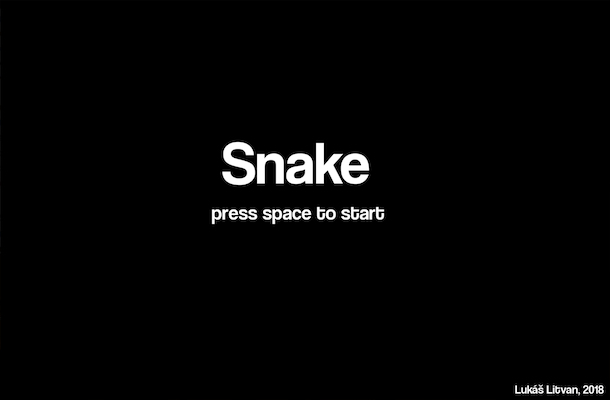
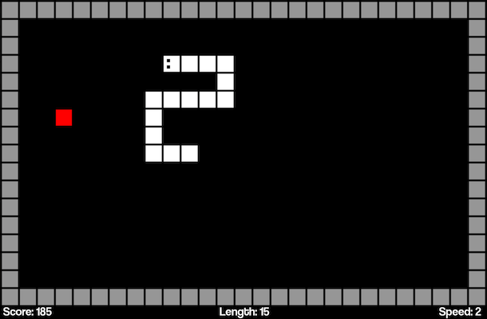
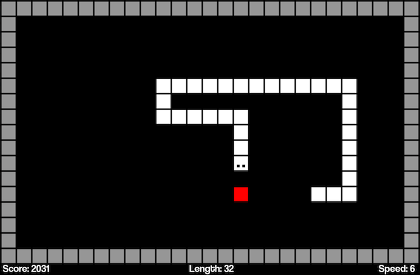
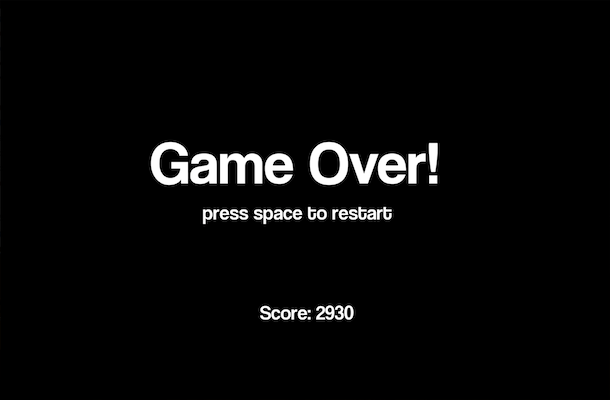

# Snake

## My version of the well known game written in C++ using SDL2 and SDL_ttf libraries.

After the first semester at university, I got slightly bored. I came to an idea to make my version of the snake using the SDL2 library, that we talked about at the last programming lecture. I also wanted to practice C++, which we are going to be learning next semester.

At first, I want to say the code is really badly written. At the beginning, I only wanted to experiment with the movement of the snake. Then I was adding more and more features but making the code more chaotic. Nonetheless, I finished the game.

The game has one minor flaw I can't solve. The longer the game is running, the longer it takes to quit after pressing ESC or clicking the close button.

   |  
:------------------------------------:|:------------------------------------:
   |  
